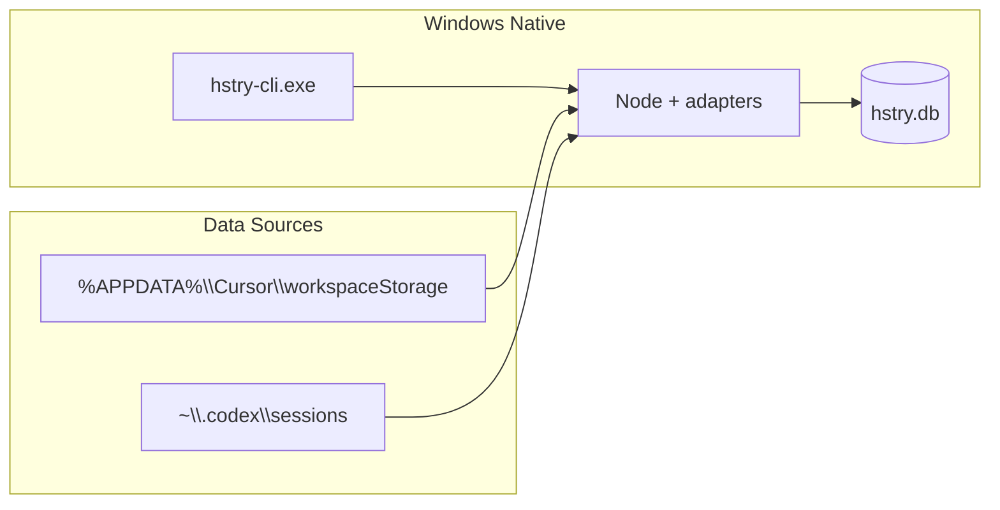

# Windows 长期支持交接文档

> 规划文档：供周末完整版 PR 接手。今晚 MVP（`service.rs` 编译/跑通）由另一 worker 负责；本文件不包含实现改动。

## 1. 背景与现状

### 项目目标

Windows 11 与 Linux / macOS 行为对等（见 [AGENTS.md](../AGENTS.md) L9）。

### 当前缺口

| 缺口 | 位置 |
|------|------|
| Release CI 仅 Linux / macOS | [`.github/workflows/release.yml`](../.github/workflows/release.yml) |
| `hstry-cli` 在 Windows 上因 `nix::signal` 失败 | [`crates/hstry-cli/src/service.rs`](../crates/hstry-cli/src/service.rs) L699–722 |
| README 无 Windows 安装说明 | [`README.md`](../README.md) |
| `just update-adapters` 仅 bash | [`justfile`](../justfile) L245–249 |

### 已有跨平台能力

- 配置路径：通过 `dirs` crate（Windows 落到 `%APPDATA%` / `%LOCALAPPDATA%`）
- Cursor adapter：已含 win32 路径（[`adapters/cursor/adapter.ts`](../adapters/cursor/adapter.ts) L34–35）
- Service 默认传输：TCP（Windows 可用；无需 Unix socket）

---

## 2. 前置工作（今晚 MVP，另见 plan）

今晚 MVP 完成时应具备：

- [`service.rs`](../crates/hstry-cli/src/service.rs) + [`Cargo.toml`](../crates/hstry-cli/Cargo.toml) 的 Windows 补丁已落地
- 本地 `import` / `search` 已验证
- 代码改动尚未合入主分支（待 PR）

接手完整版时：**先确认 MVP 分支状态**，再在其上扩展，避免重复改 `service.rs` 核心逻辑。

---

## 3. 完整版 PR 范围

### PR 1 — Windows build + core workflow（周末主 PR）

| 文件 | 改动 |
|------|------|
| [`crates/hstry-cli/src/service.rs`](../crates/hstry-cli/src/service.rs) | 完善 Win32 进程管理（若今晚 MVP 已做则 review） |
| [`crates/hstry-cli/Cargo.toml`](../crates/hstry-cli/Cargo.toml) | target-specific 依赖 |
| `scripts/update-adapters.ps1` | 新建 PowerShell 脚本 |
| [`justfile`](../justfile) | 可选加 `update-adapters-windows` recipe |
| [`README.md`](../README.md) | 新增 Windows 安装 / 编译 / 使用小节 |
| [`.github/workflows/ci.yml`](../.github/workflows/ci.yml) 或新建 | `windows-latest` + `cargo check` / `cargo test` |
| [`AGENTS.md`](../AGENTS.md) | Release 说明更新 Windows 状态 |

### PR 2 — Release 分发（可选 follow-up）

| 文件 | 改动 |
|------|------|
| [`.github/workflows/release.yml`](../.github/workflows/release.yml) | 加 `x86_64-pc-windows-msvc` zip 包 |
| Scoop manifest | `byteowlz/scoop-bucket` 新增 formula |

---

## 4. Service 子系统 Windows 测试

默认 `transport = "tcp"`。完整版必须验证：

```
hstry service enable
hstry service run          # 前台
hstry service status       # running
hstry search "..."         # 走 service（不设 HSTRY_NO_SERVICE）
hstry service stop
hstry service start        # 后台
hstry service restart
```

在 Windows 上配置 `transport = "unix"` 应给出清晰错误（已有 `#[cfg(not(unix))]` 处理）。

---

## 5. 测试矩阵

### Tier 1 — PR 必须（CI + 本地）

- `cargo check --workspace` on `windows-latest`
- `cargo test -p hstry-cli` service unit tests
- `cargo test -p hstry-core`
- 本地：import → index → search → list → show
- 配置路径落在 `%APPDATA%` / `%LOCALAPPDATA%`

### Tier 2 — PR 建议（手动）

- `hstry scan` 能检测 Cursor / Codex
- `source add` + `sync` 增量同步
- `service run` → search → stop 完整链路
- `hstry export --format markdown`
- `--json` 输出合法性
- DB 迁移：Windows `.db` 复制到 WSL → `hstry index` → search

### Tier 3 — Follow-up

- `hstry web install` + `web sync`（Playwright）
- `hstry remote sync`（SSH）
- 全量 adapter 回归
- Scoop 安装验证

---

## 6. 环境与依赖说明（写入 README）

| 依赖 | 用途 | Windows 安装 |
|------|------|--------------|
| Rust toolchain | 编译 | rustup |
| protoc | gRPC proto 编译 | `winget install Google.Protobuf` |
| Node LTS | 运行 adapter | `winget install OpenJS.NodeJS.LTS` |
| better-sqlite3 | Cursor / Codex SQLite 解析 | 在 adapters 目录 `npm install` |

**说明：**

- 运行时不使用 pnpm；adapters 由 Rust 通过 `node` / `bun` / `deno` 直接执行 TS 文件。
- 建议 `js_runtime = "node"`（Deno 不支持 `better-sqlite3` 原生模块）。

---

## 7. Windows → WSL 数据迁移

```
Windows: %LOCALAPPDATA%\hstry\hstry.db
    ↓ copy
WSL:     ~/.local/share/hstry/hstry.db
    ↓
hstry index   # 重建搜索索引
hstry search  # 验证
```

- DB 文件跨平台兼容。
- **不要**把 WSL 的 live sync 指向 `/mnt/c/...`（大量小文件极慢）。
- 建议：用 robocopy mirror 到 WSL ext4，或在 Windows 上 import 后再复制 db。

---

## 8. 架构图



---

## 9. 时间估算

| 阶段 | 耗时 |
|------|------|
| 今晚 MVP（已完成前提） | 2–4h |
| Service 端到端 + 单测 review | 2–3h |
| CI + README + 脚本 | 2–3h |
| 完整手动测试 | 3–4h |
| Release CI（可选） | 1–2h |
| **周末合计** | **1.5–2 天** |

---

## 10. 接手人 Checklist

- [ ] 确认今晚 MVP 代码已合入或基于其分支
- [ ] `cargo check --workspace` Windows 绿
- [ ] 补充 `scripts/update-adapters.ps1`
- [ ] README Windows 小节
- [ ] CI `windows-latest` job
- [ ] Tier 1 + Tier 2 测试全过
- [ ] 开 PR，附 test plan
- [ ] （可选）Release Windows zip

---

## 相关链接

- 项目约定：[AGENTS.md](../AGENTS.md)
- Release 说明：[RELEASE.md](./RELEASE.md)
- Release workflow：[`.github/workflows/release.yml`](../.github/workflows/release.yml)
- Service 实现：[`crates/hstry-cli/src/service.rs`](../crates/hstry-cli/src/service.rs)
